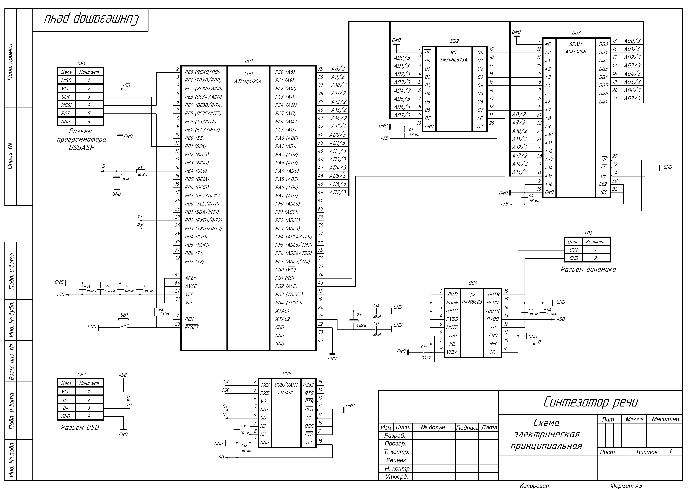

Port of a tiny TTS program SAM for AVR ATmega128

===

Software Automatic Mouth - Tiny Speech Synthesizer

Information on the SAM source code can be found in the source repository [s-macke/SAM](https://github.com/s-macke/SAM).

This repository also uses fixes from [RaafatTurki](https://github.com/s-macke/SAM/pull/14).

===

Built with `gcc version 7.3.0 (AVR_8_bit_GNU_Toolchain_3.7.0_1796)`.

Available commands:

- `make` -- build elf, hex files;
- `make flash` -- write mcu flash; 
- `make clean` -- clean.

The connection to MCU can be established by UART 9600.

The project scheme:

